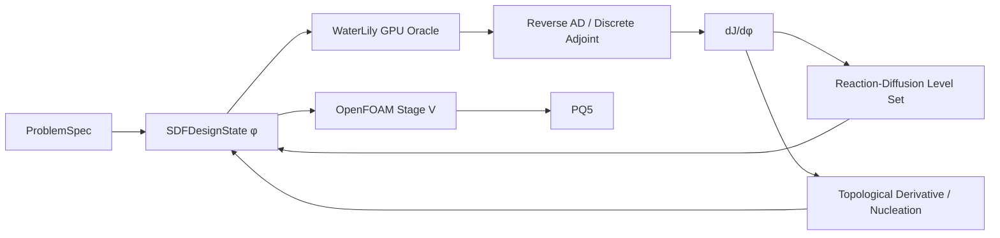
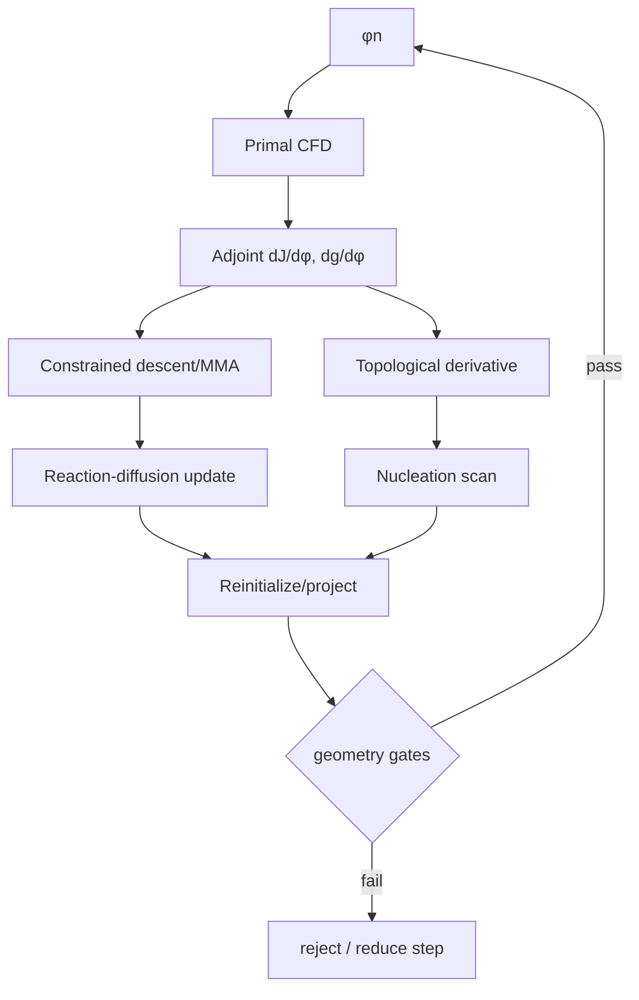
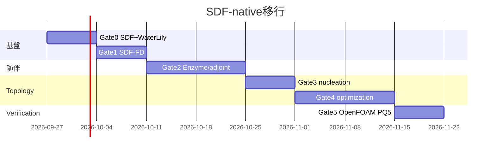

# CFD_opt_sdf を SDF-native・トポロジー可変・随伴最適化系へ再設計する修正計画書
## エグゼクティブサマリー
2026年9月26日時点でリポジトリを確認した。指定ブランチ `feat/p0-openfoam-closed-loop` は、ユーザーが最後に報告した `dfe0952` よりさらに進んでおり、現在HEADは **`ebdd01f Register Stage S reduced-basis FD v2 contract and pass S0R/S1R`** である。つまり、現リポジトリはすでに「K=16 B-spline reduced-basis FD」をStage Sとして資格化する直前まで進んでいる。 現在の計画書にも、v2 working domain、16 mode、epsilon ladder、S0R/S1R成功、`shape_update_allowed=false` が記録されている。
**このK=16 B-spline経路はここでfreezeし、本流から外すべきである。削除はしない。** `superseded_reference` として残し、これまで確立したOpenFOAM Stage V、moving-ground、far-field、domain convergence、force normalization、immutable manifest、fail-closed gateはすべて再利用する。
本流は次へ変更する。
\[
\boxed{
\phi(\mathbf x)\ {\rm SDF}
\rightarrow
{\rm immersed\ Cartesian\ CFD}
\rightarrow
{\rm discrete/reverse\ adjoint}
\rightarrow
\frac{dJ}{d\phi}
\rightarrow
{\rm level\!-\!set\ update}
+
{\rm topology\ birth}
}
\]
目的はdownforce最大化、
\[
J=-C_{DF},
\]
抗力は直接「揚抗比」を割り算するより、
\[
g_R(\phi)=R_{\min}C_D-C_{DF}\le0
\]
と置くことを推奨する。\(C_D>0\) なら \(C_{DF}/C_D\ge R_{\min}\) と等価で、分母が小さくなる際の数値的不安定性も避けられる。
**主solverはWaterLily.jlでPoCを開始する。** WaterLilyはCartesian grid、Boundary Data Immersion Method、`AutoBody(sdf)`、CPU/GPU backendを持ち、SDFをsolverへ直接渡せる。2025年のCPC論文もsolverをdifferentiableとして報告している。 ただしproduction reverse adjointはまだ完成扱いできない。**Enzyme reverse AD統合PR #290は2026年9月時点でもopen** である。 したがってWaterLilyは「最も研究目的に合う基盤」だが、「完成済みadjoint solver」ではない。
このリスクに対し、
\[
\boxed{
\text{WaterLily = 本命SDF/GPU研究solver}
}
\]
\[
\boxed{
\text{DAFoam = discrete-adjoint correctness reference}
}
\]
\[
\boxed{
\text{OpenFOAM = Stage V独立verification}
}
\]
\[
\boxed{
\text{OpenLB/TCLB = WaterLily reverse AD失敗時のPlan B}
}
\]
とするのが最も堅い。
Google AI Proには現在 **200 CCU/月のColab特典**が公式に含まれ、2026.07 Colab runtimeにはUbuntu 22.04.5とJulia 1.12.6も含まれる。ただしGPU種類・利用可能時間は保証されず、一般的なmanaged runtimeは概ね最大12時間であるため、checkpoint/resume前提にする。

## 現リポジトリの診断
現在の `src/cfd_sdf/sdf.py` はすでに重要な資産を持つ。STLからuniform Cartesian grid上へSDFを生成し、**プロジェクトのsign conventionは `phi < 0 = solid inside`**、さらにnarrow band、nearest component、normal fieldまで生成している。 したがって新規にSDF subsystemをゼロから作る必要はない。
ただし現在のSDFは、
\[
\text{STL}\rightarrow\phi
\]
の**geometry service**であり、
\[
\phi_n\rightarrow\phi_{n+1}
\]
というoptimization stateにはなっていない。ここが最初に直す箇所である。
一方、現行Stage SはB-spline control-point系へ分岐した。現在HEADでは旧S0/S1のK=16 modeを再利用し、v2 domainで16/16 modeの±1 mm deformation、watertightness、minimum width、clearance、`checkMesh`までpassしているが、flow campaignはまだ未実行である。 **したがって計算資源をS2の24 primalへ投入する前に方向転換できる。**
また現行のcanonical objectiveは `maximize downforce → J=-downforce` を明確に実装しており、raw sensitivityをcanonical gradientとして誤使用しないfail-closed contractもある。 この考え方はそのままSDF gradientへ移植する。
P21で得られたStage V evidenceも捨てない。qualified v2ではmass imbalanceの閾値が \(10^{-4}\)、ground/candidate normal fluxおよびground velocity errorが \(10^{-8}\)、upstream velocity errorが0.05、outer backflow 0.05、outer kinematic-pressure disturbance \(0.05U_\infty^2\) と事前登録され、実測でpassしている。 v2–v3では既登録の
\[
|\Delta C_{DF}|<0.005,\qquad
|\Delta C_D|/C_D<0.02
\]
もpassした。 これらは新solverでも可能な限り共通qualification contractとして維持する。
## ソルバー選定と最新研究の評価
| Solver | GPU | adjoint/reverse | SDF/immersed | topology | メモリ | 実装負荷 | 推奨用途 |
|---|---|---|---|---|---|---|---|
| **WaterLily** | CUDA◎、backend-generic | △ Enzyme PR進行中 | **◎ AutoBody(SDF)/BDIM** | ◎自作しやすい | 要実測 | **中** | **本命** |
| **OpenLB 1.9** | CUDA/HIP、SYCL試験 | ○ adjoint基盤あり | △ voxel/LBM化必要 | ◎既存TopOpt | 要実測 | 中〜高 | Plan B |
| **TCLB** | CUDA/HIP/MPI | **◎既存adjoint** | △ | **◎ field TopOpt** | 要実測 | 中〜高 | Plan B |
| **DAFoam** | CPU/MPI中心 | **◎ discrete adjoint** | △ body-fit/porosity | ○ porosity | 重い | 中 | gradient reference |
| **FluidX3D** | OpenCL◎ | × | △ voxel | △ | **55 B/cell** | 低 | 性能上限 |
| **waLBerla+lbmpy** | CUDA codegen◎ | × turnkey | ○自作 | ○自作 | 良好 | **高** | 長期自作基盤 |
WaterLilyは現在も活発で、Cartesian immersed incompressible solver、GPU backend、直接SDF geometryを備える。公式exampleには`AutoBody(sdf)`を3Dで使う例があり、AutoDiffによるfoil optimization exampleも存在する。 また外部流れについてはBiotSavartBCs.jlも2026年9月まで更新されており、小domainでのexternal-flow BCを狙った拡張がある。これは現在P21で苦労したfar-field costを将来減らせる可能性がある。
ただし、WaterLily reverse ADはまだ研究リスクがある。EnzymeそのものはJuliaでreverse modeとGPU kernel differentiationを提供する一方、WaterLilyへのreverse extensionはopen PRであり、過去にはJulia/KernelAbstractionsとのcompatibility issueも実際に報告されている。 したがって**ADが動くこととCFD gradientが正しいことを分離して検証する**。
OpenLB 1.9はCUDA、HIP/ROCmを持ち、2026年にはSYCLでIntel GPUにも展開している。adjoint optimization用frameworkと`AdjointLbSolver`も公開されているが、Doxygen自身が現状「one lattice、3D Navier–Stokes tested」と限定している。 GPLv2。
TCLBはCUDA/HIP/MPIとfield parameter型topology optimization、steady/unsteady adjoint、MMA optimizationを既に持つため、**WaterLilyのreverse ADが半年単位で詰まった場合の最も現実的な代替**である。GPLv3で、開発者自身がresearch-oriented solverと位置づけている。
ただしLBMへ移る場合は2026年のFavennecらの論文を必須チェック項目にする。境界上のlift/dragのようなmacroscopic quantityを目的関数にすると、adjoint LBM gradientがそのままでは誤る場合があり、補正法が提案されている。 したがってLBM採用時も
\[
|D_{\rm adj}-D_{\rm FD}|/|D_{\rm FD}|<0.05
\]
を免除しない。
DAFoamはJacobian-free discrete adjointを持ち、forward ADとのmachine-precision derivative verificationを公式に実施している。2026年にも6400 porosity変数のTopOpt tutorialが追加されている。 GPU inner-loopには向かないが、**「本当にadjoint sensitivityが正しいか」のreferenceとして非常に価値が高い。**
FluidX3DはD3Q19 FP32/FP16構成で55 bytes/cellを公開しており、性能・VRAM rooflineの基準にする。ただしadjointを持たないためproduction optimizerにはしない。
トポロジー変化については、level-set + reaction-diffusionは既に非圧縮流で「new holesを生成しclear boundaryを維持」する方法としてYaji/Yamada系で確立され、その後immersed-boundary + topological derivativeによる非定常流TopOptにも拡張されている。 したがって本研究では単なるHamilton–Jacobi移流より、**reaction-diffusion level-set + periodic topological-derivative nucleation**を採用する。
## 目標アーキテクチャと随伴・トポロジー戦略
設計状態を正式に、
\[
\Phi=
\{\phi,\Delta x,\mathbf x_0,
M_{\rm allowed},
M_{\rm forbidden},
M_{\rm root}\}
\]
とする。STLは**設計変数ではなくexport artifact**へ降格する。
optimization problemは、
\[
\min_\phi J(\phi)=-C_{DF}(\phi)
\]
subject to
\[
g_R=R_{\min}C_D-C_{DF}\le0,
\]
さらにclearance、minimum feature、volume/area、root connectivityを必要に応じて加える。
最初は既存v16から\(\phi_0\)を生成する。その後inner loopでSTL、snappyHexMesh、B-splineを通さない。
**Adjointは三段階で導入する。**
まずK=8–16個の**SDF field mode**
\[
\phi(\mathbf x,q)=
\phi_0(\mathbf x)+
\sum_kq_kB_k(\mathbf x)
\]
でcentered FDを取得する。これはproduction手法ではなくgradient oracleである。
次にWaterLily+Enzymeで、
\[
\frac{dJ}{d\phi}
\]
または少なくとも \(dJ/dq\) のreverse differentiationを試す。WaterLily reverse PRをそのまま盲信せず、固定commit/forkをmanifestへ保存する。Enzyme reverseはin-place array gradientをサポートする。
時間依存flowをreverseする際は全step保存を避け、checkpointingを入れる。Checkpointing.jlはEnzymeによるtime-stepping loop向けcheckpointingを既に提供する。 実装順は、
```text
forward:
φ → body measure → N warmup steps → Nsample steps → J
reverse:
J̄=1
→ sample window reverse
→ checkpoint restore/replay
→ flow-state adjoint
→ body/SDF adjoint
→ ∂J/∂φ
```
とする。最初は等間隔checkpoint、次にRevolve/treeverse型scheduleへ変更する。再計算後のstate hashをチェックし、非決定的replayはfailさせる。
gradient acceptanceは最低、
\[
\frac{|D_{\rm adj}-D_{\rm FD}|}
{\max(|D_{\rm FD}|,D_{\rm floor})}<0.05
\]
かつsign一致。near-zero方向には別absolute thresholdを設ける。
**Topology birth** はsurface gradientだけに任せない。各iterationでsurfaceをreaction-diffusion updateし、例えば5–10 iterationごとにallowed-fluid領域でtopological derivative/nucleation scoreを評価する。改善が予測され、clearance/min-feature/root policyを満たすlocal minimaへradius \(r_{\rm nuc}\) のsolid seedを置く。
現行sign convention \(\phi<0\) solidなら、
\[
\phi_{\rm new}(\mathbf x)
=
\min[
\phi(\mathbf x),
\|\mathbf x-\mathbf x_i\|-r_{\rm nuc}
]
\]
で新しいsolid componentを生成できる。hole生成は逆演算を使う。nucleation後はreinitialization、
\[
|\nabla\phi|\approx1,
\]
minimum-feature filter、connectivity gateを通す。

## 実装変更
現在のPython orchestrationは残し、Julia solverを独立subpackageとして追加する。Python↔Juliaは最初からFFIにせず、**manifest JSON → Julia process → outcome JSON** にする。これがColab・Docker・CIで最も再現しやすい。
| ファイル | 変更 |
|---|---|
| `src/cfd_sdf/sdf_design_state.py` | `SDFDesignState`, hash, sign, masks, reinit |
| `src/cfd_sdf/sdf_modes.py` | K=8–16 field perturbation |
| `src/cfd_sdf/sdf_objective.py` | `J=-CDF`, ratio constraint |
| `src/cfd_sdf/waterlily_oracle.py` | Julia subprocess adapter |
| `src/cfd_sdf/adjoint_contract.py` | primal/adjoint/FD derivative evidence |
| `src/cfd_sdf/topology_birth.py` | nucleation proposals/gates |
| `julia/CFDSDFWaterLily/Project.toml` | pinned Julia dependencies |
| `julia/CFDSDFWaterLily/src/oracle.jl` | WaterLily simulation |
| `.../forces.jl` | Cd/CDF time-average |
| `.../sdf_body.jl` | gridded φ→WaterLily body |
| `.../adjoint.jl` | Enzyme/replay/checkpoint |
| `.../topology.jl` | reaction-diffusion/nucleation |
| `scripts/register_sdf_native_gate0.py` | immutable contract |
| `scripts/run_sdf_native_campaign.py` | resumable jobs |
| `notebooks/colab_bootstrap.ipynb` | hosted GPU launcher |
| `.github/workflows/ci.yml` | Julia CPU smoke jobs追加 |
既存 `src/cfd_sdf/sdf.py` のSTL→SDF生成とnormal計算は初期化用として残す。 現在の`pyproject.toml`はPython側のみで、Julia依存は存在しないためJulia環境をrepo内で別lockする。 CIは現在`ci.yml`一本なので、そこへ最低 `python-unit`, `julia-cpu-smoke`, `manifest-determinism`, `sdf-adjoint-fd-small` を追加する。 GPU CIはGitHub-hostedを前提にせず、optional self-hosted/GCE nightlyとする。
最初のcommitは概ね次の形にする。
```python
@dataclass(frozen=True)
class SDFDesignState:
    phi: np.ndarray
    origin_m: tuple[float, float, float]
    spacing_m: float
    allowed: np.ndarray
    forbidden: np.ndarray
    root: np.ndarray
    def validate(self):
        assert self.phi.dtype == np.float32
        assert self.phi.shape == self.allowed.shape
        assert np.isfinite(self.phi).all()
    def sha256(self) -> str:
        ...
```
```python
def ratio_constraint(c_drag, c_downforce, r_min):
    # CDF/CD >= Rmin without division
    return r_min * c_drag - c_downforce
```
既存 `stage_s_reduced_basis_fd_v2_*` evidenceは変更・削除せず、
```json
{
  "status": "superseded_reference",
  "superseded_by": "stage_s_sdf_native_v1",
  "reason": "design representation changed from B-spline to SDF"
}
```
という**新しいsidecar manifest**だけ追加する。
## ゲート計画とColab・ローカル実行
| Gate | 実験 | Pass条件 | 初期予算上限* |
|---|---|---|---:|
| **Gate0** | SDFDesignState + WaterLily v16、2 grids、既知比較形状 | force sign一致、順位一致、mass≤1e-4、outer disturbance≤0.05、grid trend正常 | 10 CCU |
| **Gate1** | K=8–16 SDF modes、±FD | ±case全gate pass、epsilon plateau、sign repeatability | 25 CCU |
| **Gate2** | reverse AD / adjoint | random ≥3方向でadjoint-FD誤差<5%、sign全一致 | 45 CCU |
| **Gate3** | nucleation | sphere birth/hole unit test + CFD testcaseでobjective descent | 20 CCU |
| **Gate4** | full optimization | \(C_{DF}\)改善、\(g_R\le0\)、全hard gate、topology変化を実証 | 80 CCU |
| **Gate5** | OpenFOAM PQ5 | 同一candidateで3-grid、改善ranking保持、domain criteria維持 | CPU/local |
\*CCUは**予測消費ではなく月200 CCU内に収める停止budget**。ColabのGPU割当とCCU consumption rateは動的なので、Gate0最初の3 runで `CCU/run`, wall time, VRAM/cellを測り全予算を更新する。Google AI Proの200 CCUとGPU availabilityの非保証は公式仕様である。
Gate0のcross-solverについてWaterLilyとOpenFOAMの絶対値一致をいきなり5%にしない。BDIMとbody-fitted FVMでは離散化が違うため、最初は**drag/downforce符号・candidate ranking・grid trend**をhard gateにする。絶対誤差は記録し、2-grid/3-grid convergence後にfreezeする。
Gate1は旧B-spline modeではなくEulerian SDF modes。最低3代表mode×4 epsilon×2 sign = 24 primalでepsilonを資格化し、その後全K modeへ拡張する。
Gate2は最重要で、
\[
D_{\rm FD}=
\frac{J(\phi+\epsilon v)-J(\phi-\epsilon v)}
{2\epsilon},
\qquad
D_{\rm adj}=
\nabla_\phi J\cdot v
\]
をrandom、low/high frequency、projected-gradient方向で比較する。ここをpassしないadjointはproductionへ入れない。
**Colab notebookはロジックを持たせない。**
```bash
!git clone <repo>
%cd CFD_opt_sdf
!nvidia-smi
!julia --project=julia/CFDSDFWaterLily \
  -e 'using Pkg; Pkg.instantiate(); Pkg.precompile()'
!python scripts/run_sdf_native_campaign.py \
  --manifest ... --resume
```
Colab 2026.07にはJulia 1.12.6が入るが、WaterLily-Enzyme reverse integrationはまだPR段階なので、**Gate2用Julia/Enzyme/WaterLily commitはmanifestで完全pin**する。 各job終了ごとにGoogle Driveへ、
```text
outcome.json
environment.json
manifest.json
forces.csv
checkpoint/
logs/
```
をatomic copyし、SHA検証後に`completed=true`を付ける。Colab切断後はcompleted jobをskipしてresumeする。
RTX 4070 Tiは**主local GPU backend**とする。LinuxまたはWindows+WSL2、NVIDIA driver、Julia+CUDAを推奨。Dockerを使うなら`nvidia-container-toolkit`で環境を固定する。MacBook AirはWaterLily CPU smoke、SDF生成、manifest、visualization、unit test用とし、production CFD/adjoint GPU backendにはしない。WaterLily公式に確立したNVIDIA GPU経路はCUDAであり、Apple GPUを本研究のproduction backendにする根拠は現時点で不足する。
OpenFOAMはColab inner loopへ持ち込まず、Gate5をlocal Dockerまたは既存環境で実施する。

## 直近の実行順とエンジニア向け引き継ぎ
**今すぐ行う7アクションはこの順番。**
1. `ebdd01f` のK=16 B-spline Stage Sを`superseded_reference`としてfreezeし、S2 primalを開始しない。現在HEADは実際にS0R/S1Rまでで止まっているため、方向転換コストは最小である。
2. `src/cfd_sdf/sdf_design_state.py` を追加し、現行`phi<0=solid`、allowed/forbidden/root、SHA、reinitializationをfirst-class contract化する。
3. `julia/CFDSDFWaterLily` を追加し、まずCPU sphere → CUDA sphere → v16 SDFの順でWaterLilyOracleを通す。WaterLilyは直接SDFを`AutoBody`へ与えられる。
4. v2 P21条件をWaterLily側へ移植し、moving ground、external boundary、force sign/normalizationをGate0 manifestに固定する。WaterLilyのBiotSavart外部BCは別実験として比較する。
5. `K=8` SDF modesでcentered-FDの最小gradient qualificationを作る。B-splineは使用しない。
6. WaterLily PR #290のEnzyme reverse branchを**vendorせずcommit pinしてPoC**し、3 directional derivativeで5% gateを試す。失敗時はFD basisを維持してOpenLB/TCLB spikeへ移る。
7. reverse gradientが資格化された後だけreaction-diffusion + nucleationを導入し、最初の「翼要素birth」を2D/小3D testcaseで実証してからfull v16へ進む。level-set immersed CFDとtopological derivativeの組合せには既存研究実績がある。
**エンジニア向け一枚要約:**
`CFD_opt_sdf` の価値ある既存資産は、SDF生成、ProblemSpec、canonical objective、P21で確立したphysical-profile gate、OpenFOAM Stage V、immutable evidence体系である。捨てるのはK=16 B-splineをproduction Stage Sにする方針だけ。新本流ではSDF \(\phi\)を唯一のgeometry design stateとし、WaterLilyのimmersed Cartesian GPU solverをinner loop、Enzyme reverse/discrete adjointをproduction gradient、centered FDを永久的なgradient oracleとする。最適化はdownforce最大化、\(R_{\min}C_D-C_{DF}\le0\)をdrag-efficiency制約とする。surface evolutionにはreaction-diffusion level set、topology birthにはtopological-derivative guided nucleationを使う。WaterLily reverse ADが5% FD gateを満たせなければ、研究を止めずK≤16 SDF-FDをfallbackとし、並行してTCLB/OpenLBへ移行する。最終truthは現行OpenFOAM Stage V/PQ5で独立検証する。この構成なら、**SDF・随伴・トポロジー変化・GPU・独立verificationが一つの研究ストーリーとして再び整合する。**
