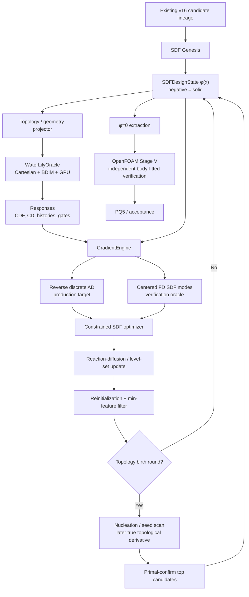
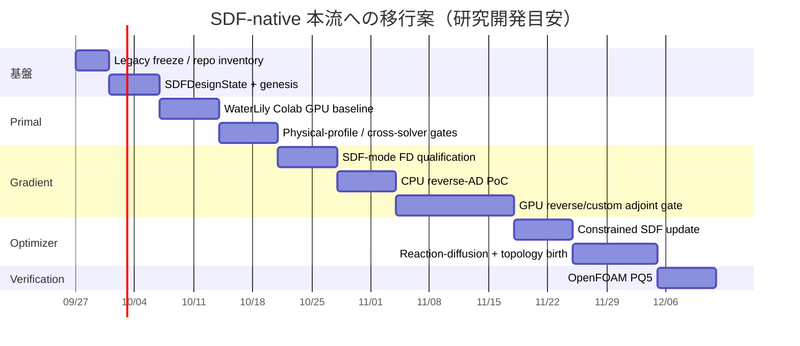

# CFD_opt_sdf を SDF-native・随伴・トポロジー可変最適化系へ戻すための再設計案
## エグゼクティブサマリー
結論から言うと、**現在の B-spline / K=16 Stage S は本流から外し、`CFD_opt_sdf` を当初の思想へ戻すべきです。** ただし、ここまでに成立させた Stage V、moving-ground/freestream physical-profile、domain-convergence、candidate lineage、fail-closed gate は捨てません。それらはむしろ、新しい SDF optimizer を評価する独立した「truth layer」として非常に価値があります。
本流は次に変更するのが最も筋が通っています。
\[
\boxed{
\phi(\mathbf x)
\rightarrow
\text{GPU Cartesian/immersed CFD}
\rightarrow
\text{discrete/reverse adjoint}
\rightarrow
\frac{\delta J}{\delta \phi}
\rightarrow
\text{reaction-diffusion / level-set update}
\rightarrow
\text{topology birth}
\rightarrow
\phi_{\rm new}
}
\]
ここで \(\phi\) は単なる STL 生成の補助表現ではなく、**唯一の canonical design state** とします。STL、OpenFOAM mesh、B-spline control points は design state ではなく派生 artifact に降格させます。
内側の primal solver は、現時点では **WaterLily.jl を第一 PoC 候補**にするのが合理的です。WaterLily は Cartesian grid 上の incompressible Navier–Stokes solver で、BDIM により SDF で記述された immersed body を扱い、`CuArray` を介した NVIDIA GPU 実行をサポートしています。2025年の論文でも differentiable / backend-agnostic CFD solver として整理されています。
ただし、ここに非常に重要な訂正があります。**2026年9月26日時点で、WaterLily の full reverse AD を GPU production-ready と見なしてはいけません。** 現在の本命は open PR **#285 “Reverse AD via Enzyme extension”** で、CPU 上では full `sim_step!` の reverse-mode が成立し、Poisson solve に implicit-function-theorem ベースの custom reverse rule が導入されています。しかし PR 自身が、CUDA reverse では `cuMemcpyHtoDAsync_v2` に対する Enzyme rule 不足によりまだ停止すると明記しています。さらに CPU の gradient も Poisson tolerance に依存し、デフォルト設定では ForwardDiff との差が約10%だったものが、Poisson tolerance を \(10^{-10}\) まで厳しくすると約 \(2.4\times10^{-5}\) まで改善した、という結果です。したがって **「WaterLilyだから随伴も完成済み」ではありません。**
これを踏まえ、solver と gradient engine を分離します。
| 層 | 推奨 |
|---|---|
| canonical design | **Cartesian SDF \(\phi\)** |
| inner primal | **WaterLily GPU** |
| gradient verification | **centered FD on K=8–16 SDF directions** |
| first reverse-AD PoC | **WaterLily + PR #285 + Enzyme、CPU** |
| production gradient target | **GPU reverse AD または custom discrete adjoint** |
| topology evolution | **reaction-diffusion level set + explicit nucleation scan** |
| objective | \(-C_{DF}\) 最小化 |
| drag handling | **\(C_D\le C_{D,\max}\) を第一選択**、必要なら \(C_{DF}/C_D\ge R_{\min}\) |
| independent verification | **既存 OpenFOAM Stage V** |
| secondary gradient reference | **DAFoam discrete adjoint** |
| primary compute | **Colab AI Pro、200 CCU/月をユーザー指定の計画上限として扱う** |
| strict provenance | local/GCE Docker reference |
つまり、今後の成否を分ける最初の大きな gate は、
\[
\boxed{
\text{WaterLily GPU primal が成立するか}
}
\]
ではなく、その次の
\[
\boxed{
\text{full-field }\phi\text{ に対する reverse gradient を GPU で成立させられるか}
}
\]
です。
ここが短期間で突破できなければ、WaterLily を捨てる必要はありません。WaterLily は primal と FD verification oracle として残し、gradient engine を custom discrete adjoint に差し替えます。それでも開発量が過大なら **OpenLB を第二候補、waLBerla+lbmpy を長期自作基盤**とします。OpenLB 1.9 は GPU と adjoint optimization の双方を明示的に開発対象としており、waLBerla/lbmpy は symbolic LBM から CPU/GPU kernel を生成できるため、随伴 kernel まで自前生成する場合の基盤として強力です。
なお、本調査時には接続された GitHub index からユーザーの `CFD2026_09` private repository 自体を解決できなかったため、リポジトリ部分はこの会話で提示された **実コミット、実パス、SHA、manifest、テスト結果**に基づいています。したがって最初の実装コミットでは、現在 checkout の機械的 inventory を生成し、以下のマッピングを実ファイル SHA と照合する工程を必須にします。
## リポジトリの現状と、何を残し何を置き換えるか
現在の `dfe0952 Qualify v16 physical profile and domain convergence` までで成立したものはかなり重要です。特に candidate SHA
```text
5e6d210794b55a11f3dc76b8be37eeb39d27579b341212939a1c2a63d2fb8d11
```
と physical-profile SHA
```text
a84670733ad5009ee57e84b9ee40b19da3254aae45846e5fb7a7f3ae8f72ceca
```
を共有する v2/v3 domain が domain-converged していること、moving ground と freestream outer condition が明示的 contract になったことは、新しい optimizer の初期条件・検証条件としてそのまま使えます。
逆に、**B-spline control-point space と K=16 reduced basis は optimizer の本流から外します。** 削除はせず、`superseded_not_run` / diagnostic evidence として凍結します。
### 既存ファイルから新構造への対応
| 現在の資産 | 現在の意味 | 新アーキテクチャでの扱い | 必要変更 |
|---|---|---|---|
| `src/cfd_sdf/config.py` | ProblemSpec / BC 等 | solver-independent contract の中核として維持 | `SDFGridSpec`, `ForceContract`, `ExecutionBackendSpec`, gradient/topology spec を追加 |
| `src/cfd_sdf/openfoam.py` | OpenFOAM case materialization / BC / Stage V | **Stage V Oracle** として維持 | inner-loop code と分離し `OpenFOAMStageVOracle` 化 |
| `src/cfd_sdf/sdf.py` | STL/SDF geometry utility | **canonical design state の核**へ昇格 | state / interpolation / reinit / Boolean ops に分割 |
| v16 candidate STL | canonical candidate geometry | \(\phi_0\) の genesis source と Stage V export | inner loop では使用しない |
| `design_domain.stl` | design domain | allowed/frozen masks 生成元 | Cartesian mask として固定 |
| candidate lineage JSON | candidate provenance | 新 SDF lineage の親 | `source_candidate_sha` として継承 |
| physical-profile manifest v2 | BC/physics provenance | **solver-independent semantic physical profile** | backend-specific adapter hash を子に追加 |
| expanded-domain v2/v3 outcome | P21 解消証拠 | SDF solver cross-validation reference | immutable のまま |
| K=16 B-spline modes | Stage S shape basis | **本流では使用停止** | 2–4方向だけ migration holdout に変換可能 |
| Stage S FD scripts | reduced FD machinery | verification の思想のみ再利用 | B-spline perturbation を SDF perturbation に置換 |
| tests | fail-closed infrastructure | かなり再利用可能 | SDF/WaterLily/adjoint/topology tests 追加 |
| OpenFOAM Docker manifest | strict execution provenance | Stage V reference 用に維持 | Colab manifest を別に作る |
| phase/problem/current-state docs | authoritative state | 方針転換を明示 | B-spline Stage S を superseded と記録 |
`src/cfd_sdf/sdf.py` は、「STLから距離を作る関数」ではなく、最終的に次のような型を中心に再設計するべきです。
```python
@dataclass(frozen=True)
class SDFDesignState:
    phi_uri: str
    shape: tuple[int, int, int]
    origin_m: tuple[float, float, float]
    spacing_m: tuple[float, float, float]
    # Canonical convention
    sign_convention: Literal["negative_solid"]
    allowed_design_mask_uri: str
    frozen_solid_mask_uri: str | None
    frozen_fluid_mask_uri: str | None
    min_feature_m: float
    parent_design_sha256: str | None
    sha256: str
```
以後、
\[
\boxed{\phi<0:\text{solid},\qquad \phi>0:\text{fluid}}
\]
を repo 全体の immutable convention にします。
STL は、
\[
\phi\rightarrow \Gamma=\{\phi=0\}\rightarrow STL
\]
という **verification/export artifact** にします。
### K=16資産は捨てず、資格の継承もしない
旧K=16 basisをそのまま「SDF mode」と呼び替えるのは避けるべきです。物理profileも design representation も変わるので、旧資格を継承できません。
ただし migration test としては価値があります。旧 B-spline が作った surface normal displacement \(d_n\) を、SDF narrow band 上の
\[
\delta\phi \simeq -d_n|\nabla\phi|
\]
へ投影すれば、旧 branch と新 branch が「同じような形状方向」に対して同じ response sign を返すかを確認できます。
これは main optimizer の basis ではなく、**legacy-equivalence holdout** として2–4方向だけ使うのがよいです。
### 最初に追加する repository inventory
最初の変更では solver をまだ入れず、
```text
docs/evidence/repo_inventory_sdf_native_v1.json
```
を自動生成します。
最低限、
```text
git SHA
全 src/cfd_sdf/*.py
全 Stage T/S/V scripts
SDF関連関数・class
K=16 asset paths + hashes
Docker manifests
candidate lineage
physical-profile manifests
canonical STL hashes
all tests touching geometry / OpenFOAM / FD / adjoint
```
を固定します。
これによって以後の設計変更が「何を置換し、何を保持したか」まで provenance に残ります。
## 文献調査と solver / adjoint stack の選定
### 最優先で読むべき論文
以下の10本を、今回の設計に直接効く順に並べます。
| 優先 | 論文 | 要点 | 今回採るもの | 公開コード |
|---|---|---|---|---|
| ★★★★★ | Weymouth & Font, **WaterLily.jl: A differentiable and backend-agnostic Julia solver…**, CPC 2025 | Cartesian immersed CFD、GPU backend、differentiable solver | primal backend の基礎 | **WaterLilyあり**  |
| ★★★★★ | Weymouth & Yue, **Boundary Data Immersion Method**, JCP 2011 | Cartesian grid 上で immersed boundary を構成 | SDF→flow coupling の基礎 | WaterLilyに実装系あり  |
| ★★★★★ | Yamada et al., **Level set method incorporating fictitious interface energy**, CMAME 2010 | reaction–diffusion equation で level set を更新し、形状複雑性を正則化 | topology-changing update の中核 | 今回公開実装は確認できず  |
| ★★★★★ | Yaji et al., **Topology optimization using LBM incorporating level set boundary expressions**, JCP 2014 | level set + CFD topology optimization | SDF-native流体TopOptの直接的先例 | 公開コード未確認  |
| ★★★★☆ | Liu et al., **Discrete adjoint sensitivity analysis … generalized LBM**, 2014 | 離散随伴とporosity/topology sensitivity | discretize-then-differentiateの設計参考 | 未確認  |
| ★★★★☆ | Nørgaard, Sigmund & Lazarov, **Topology optimization of unsteady flow problems using LBM**, JCP 2016 | unsteady flow + discrete adjoint + topology | time-dependent adjointの参考 | 未確認  |
| ★★★★☆ | Garcke et al., **Phase field approach to shape optimization in Navier–Stokes flow with integral state constraint**, 2017 | drag等のstate constraintを持つNavier–Stokes shape/topology optimization | 「downforce最大化 + drag constraint」の数理設計に近い | 論文公開、実装未確認  |
| ★★★★☆ | Oka & Yamada, **Topology optimization method with nonlinear diffusion**, 2023 | reaction–diffusion level-setを非線形拡散へ一般化 | topology update安定化の次段階 | 論文公開、コード未確認  |
| ★★★★☆ | Cheylan, Ribereau & Favier, **Direct-adjoint LBM solver for turbulent FSI and shape optimization**, 2026 | immersed boundaryを含む直接/随伴solver、高Re/非定常への展開 | 将来のimmersed adjoint設計の参考 | 今回コード未確認  |
| ★★★★★ | Favennec et al., **Adjoint-state LBM: necessary correction when cost function incorporates macroscopic quantities on boundaries**, 2026 | boundary上のlift/drag等を目的関数にするとadjoint gradientが誤る場合を明示 | **force gradientは必ずFDで検証** | 論文を最重要pitfallとして採用  |
特に最後の論文は、LBM solver にフォールバックするとき重要です。LBMの状態はmesoscopic distributionなのに、drag/liftはmacroscopic boundary quantityなので、素朴なadjoint導出では一致しないケースがあり、論文はその補正を扱っています。したがって OpenLB/TCLB に「adjoint機能がある」というだけでは採用せず、
\[
D_{\rm adj}\stackrel{?}{=}D_{\rm FD}
\]
を現在の fail-closed policy のまま維持すべきです。
### Solver stack比較
| stack | SDF/Cartesian | immersed BC | GPU | reverse/discrete adjoint | topologyとの親和性 | 成熟度 | license | Colab適性 | 推奨役割 |
|---|---:|---:|---:|---:|---:|---:|---|---:|---|
| **WaterLily.jl** | **◎** | **◎ BDIM** | **◎** | △ **CPU PRあり、GPU未解決** | **◎** | ○ 研究活発 | MIT | **◎** | **第一PoC / inner primal** |
| **DAFoam** | △ | △ 主にbody-fitted/porosity | △ CPU中心 | **◎ discrete AD** | ○ porosity TopOpt | **◎** | OpenFOAM系、配布時確認 | △ | gradient/reference |
| **OpenFOAM** | △ | △ | ×〜△ | 現行repoではcontinuous adjoint問題 | △ | **◎** | OpenFOAM terms | △ | **Stage V truth** |
| **OpenLB** | ○ | ○ | **◎** | **○〜◎ adjoint stack** | **◎** | ○〜◎ | 配布条件要確認 | ○ | WaterLily失敗時の第2候補 |
| **TCLB** | ○ | ○ | ○〜◎ | **◎ documented adjoint** | **◎ field parameter** | △〜○ | 要確認 | ○ | alternative research backend |
| **waLBerla + lbmpy** | ○ 自作 | ○ 自作 | **◎** | △ **自作** | **◎** | **◎ framework** | componentごと確認 | ○ | 長期custom production |
| **FluidX3D** | ○ voxel | ○ | **◎◎** | × | × | ○ | **source-available / non-commercial** | ◎ | performance rooflineのみ |
WaterLily は現在の `Simulation` API で `Array`, `CuArray`, ROCm memory backend を選べ、`AbstractBody` / `AutoBody` を通じて SDF geometry を immersed body として扱える構造です。また現行 metrics には pressure force、viscous force、およびその和である total force が実装されています。したがって downforce と drag では **pressureだけでなく total force を使う**のが今回の force contract に合います。
WaterLily 自体の license は MIT Expat です。
一方で reverse AD は最大のリスクです。PR #285 は multigrid Poisson を black-box linear solve として扱い、
\[
A\lambda=\bar x
\]
を解く custom reverse rule を実装しており、これはまさに今回必要な **discrete implicit adjoint** の方向です。しかし現在 GPU reverse は CUDA driver call の rule gap で止まります。したがってこのPRは「そのままproduction導入する依存先」ではなく、**forkして固定commitを参照する adjoint研究用ブランチ**として扱います。
DAFoam は逆にGPU inner loop候補ではありませんが、公式 verification で adjoint derivative と forward-mode AD を照合する体系を持ち、DASimpleFoamのshape derivative examplesではforward ADとの非常に高精度な整合を示しています。またporosity topology optimization tutorialも提供しています。これは新しい SDF adjoint の「第三者 gradient reference」として価値があります。
OpenLB 1.9 は2025年末のリリースで adjoint optimization を用途として明示し、NVIDIA GPUに加えてAMD HIP/ROCm方向も拡張しています。WaterLily+EnzymeのGPU reverseが詰まった場合、**既存adjointを持つGPU Cartesian系**として真面目に第二PoCへ上げる価値があります。
waLBerla/lbmpy はさらに低レベルですが、lbmpy/pystencilsがsymbolic LBM formulationから最適化されたCPU/CUDA/HIP kernelを生成できます。つまり「最終的にadjoint kernelまで自前生成する」場合には WaterLily より大きな開発量と引き換えに自由度が高いです。
FluidX3D は adjoint optimizerには向きませんが、D3Q19でFP16 storageを用いる構成では55 bytes/cellという非常に小さなmemory footprintを公式に掲げています。そのため将来の自作 solver に対する「GPU memory / throughput 上限の比較対象」として残す価値があります。現行licenseは通常のOSS licenseではなく、商用利用制約を持つsource-available形態なので、コード流用より性能比較に限定するのが安全です。
## 提案する SDF-native アーキテクチャ
### 全体データフロー

### SDF は「geometry file」ではなく状態変数
新しい inner loop では、
\[
\phi_n(\mathbf x)
\]
そのものを optimizer state とし、
\[
\Gamma_n=\{\mathbf x:\phi_n(\mathbf x)=0\}
\]
のみを物体境界とします。
PoCでは CFD grid と SDF grid を同一にします。後から、
\[
h_\phi=2h_{\rm CFD}
\]
のような design-grid coarsening を許せますが、最初から二重格子を入れると gradient debugging が難しくなります。
WaterLily の標準 `AutoBody` は callable SDF を受け取れますが、今回必要なのは数式SDFではなく **数百万 voxel の \(\phi_{ijk}\) 全てを設計変数にすること**です。したがって `CuArray` を closure から参照するだけではなく、専用の
```julia
struct GridSDFBody{T,A} <: AbstractBody
    phi::A
    origin::SVector{3,T}
    spacing::SVector{3,T}
end
```
を実装し、GPU kernel 内で型安定に
\[
d(\mathbf x)=I[\phi](\mathbf x)
\]
と
\[
\nabla d(\mathbf x)
\]
を評価できるようにするのがよいです。WaterLily は custom `AbstractBody` を差し込める構造になっています。
初版はtrilinear interpolationでよいですが、adjoint noiseが大きければtricubic/B-spline interpolationへ移行します。ここでのB-splineは**design parameterizationではなく interpolation kernel**なので、旧Stage Sへ戻るわけではありません。
### 目的関数と drag constraint
downforceを正とする現在のrepo conventionを維持し、
\[
\boxed{
J(\phi)=-\overline C_{DF}(\phi)
}
\]
を最小化します。
第一選択のdrag constraintは、
\[
\boxed{
g_D(\phi)=\overline C_D(\phi)-C_{D,\max}\le0
}
\]
です。
ユーザーがL/D型を重視する場合、
\[
g_R(\phi)
=
R_{\min}
-
\frac{\overline C_{DF}}
{\overline C_D+\epsilon_D}
\le0
\]
を追加できます。
ただし本質的な目的が「downforce最大化」なら、**ratioをobjectiveにするよりdrag capをconstraintにする方が意図が明確**です。ratio maximization は downforceを増やさなくても drag を落とすことで改善できるためです。
GarckeらのNavier–Stokes shape/topology optimizationでも、dragを含むstate constraintとlift最大化の例が扱われており、今回の「force objective + force constraint」に近い数理的先例があります。
最終的には、
\[
\mathcal L
=
-C_{DF}
+
\lambda_D g_D
+
R_{\rm geom}
\]
のようなLagrangianにし、
\[
\frac{\delta\mathcal L}{\delta\phi}
\]
を一つの reverse seed から得られる構造にします。verification時だけ \(C_D,C_{DF}\) の勾配を別々に取ります。
### Reverse / discrete adjoint
離散時間系を
\[
x_{n+1}=F_n(x_n,\phi)
\]
とすると、reverse recurrence は概念的には
\[
\lambda_n
=
\left(
\frac{\partial F_n}{\partial x_n}
\right)^T
\lambda_{n+1}
+
\frac{\partial \ell_n}{\partial x_n},
\]
\[
\frac{dJ}{d\phi}
=
\frac{\partial J}{\partial\phi}
+
\sum_n
\left(
\frac{\partial F_n}{\partial\phi}
\right)^T
\lambda_{n+1}.
\]
この「実装された離散schemeそのもの」を逆向きに微分する方針を採ります。
WaterLily PR #285 が Poisson solve に対してやっている
\[
A p=b,
\qquad
A^T\lambda=\bar p
\]
という implicit reverse ruleはこの構造とよく合います。PRではBDIMを含むPoisson operatorの対称性を利用し、同じmultigrid solverでadjoint solveを行っています。
一方、**Poisson convergence toleranceもgradient contractの一部**にしなければなりません。PR #285 の作者テストでは、緩いPoisson toleranceでは約10%の差が出ており、toleranceを厳しくすると \(10^{-5}\) オーダーまで改善しています。これは「primal residualが十分に見えてもgradientには不十分」という典型例なので、現在のrepoのfail-closed思想に非常によく合います。
長時間の非定常計算をすべてreverse tapeへ保存することは避けます。最初は、
```text
spin-up primal
      ↓
checkpoint x(t0)
      ↓
有限 averaging window [t0,t1]
      ↓
そのwindowだけreverse
```
とします。
その後必要なら segment checkpoint + recomputation を導入します。
### Topology birth は二層構造にする
単なる narrow-band Hamilton–Jacobi updateだけでは、既存境界の移動・merge/splitは得意でも、離れた流体領域に新しいwing elementを発生させるのが弱いです。
そこで、
\[
\boxed{
\text{global reaction-diffusion update}
+
\text{explicit nucleation operator}
}
\]
にします。
Yamadaらのreaction–diffusion level-set法は level-set field をPDEで更新し、fictitious interface energyで形状複雑性を制御する枠組みです。後続のOka・Yamadaは nonlinear diffusionへ一般化しています。
最初の nucleation は「厳密なtopological derivative」と呼ばない方がよいです。まず、
1. allowed fluid region に候補seedを走査。
2. adjoint \(\delta\mathcal L/\delta\phi\) をseed footprintで積分。
3. 最も改善予測の大きい1–3候補だけ実際にsolidとして生やす。
4. primalで本当に \(\mathcal L\) が改善した候補だけaccept。
とします。
negative-solid conventionなら、新しいsolid seed \(\phi_s\) の union は、
\[
\phi_{\rm new}
=
\min(\phi,\phi_s)
\]
です。
穴を開ける場合は、
\[
\phi_{\rm new}
=
\max(\phi,-\phi_s).
\]
これだけで、
- birth
- merge
- split
- deletion
を同じSDF state上で表現できます。
厳密なNavier–Stokes topological derivativeは後から追加し、それまでは名称も `adjoint_seed_score` として区別します。
## 実装ロードマップと Colab 実行設計
### コード変更
Python側は orchestration / provenance / optimization policy を担当し、Julia側をGPU numerical kernelにします。
提案構造は次です。
```text
src/cfd_sdf/
    design/
        sdf_state.py
        sdf_ops.py
        reinitialize.py
        filters.py
        lineage.py
    oracles/
        base.py
        waterlily.py
        openfoam_stage_v.py
    gradients/
        fd_sdf.py
        reverse.py
        dot_test.py
    topology/
        birth.py
        seed_library.py
    optimizer/
        levelset.py
        constraints.py
        augmented_lagrangian.py
    execution/
        jobs.py
        colab.py
        fingerprints.py
julia/
    Project.toml
    Manifest.toml
    src/
        CFDSDFNative.jl
        GridSDFBody.jl
        BoundaryProfile.jl
        Responses.jl
        Adjoint.jl
        Checkpointing.jl
notebooks/
    colab_bootstrap.ipynb
scripts/
    inventory_sdf_native_repo.py
    register_sdf_native_contract.py
    build_v16_sdf_genesis.py
    run_waterlily_baseline.py
    qualify_sdf_fd_gradient.py
    qualify_reverse_gradient.py
    demo_topology_birth.py
    compare_waterlily_openfoam.py
```
Oracle APIは、
```python
class ResponseOracle(Protocol):
    def run_primal(
        self,
        design: SDFDesignState,
        problem: ProblemSpec,
        execution: ExecutionBackendSpec,
    ) -> PrimalOutcome:
        ...
    def run_vjp(
        self,
        design: SDFDesignState,
        checkpoint: PrimalCheckpoint,
        response_seed: ResponseSeed,
        execution: ExecutionBackendSpec,
    ) -> GradientOutcome:
        ...
```
程度に固定します。
重要なのは、
\[
\boxed{\texttt{run\_vjp} \neq \texttt{WaterLily固有}}
\]
とすることです。
これならWaterLily GPU reverseが破綻しても、
```text
WaterLilyPrimal
+
CustomAdjointGradient
```
や、
```text
OpenLBPrimal
+
OpenLBAdjoint
```
へ差し替えられます。
### physical-profileをsolver-independent semantic contractにする
現在の
```text
moving ground
far-field
U∞
ν/Re
force normalization
candidate provenance
```
はOpenFOAM辞書そのものではなく、**意味論レベルの contract** として維持します。
その下に、
```text
OpenFOAMBoundaryAdapter
WaterLilyBoundaryAdapter
```
を置きます。
WaterLily は `uBC(i,x,t)` で空間・時間依存のvelocity boundaryを与えられますが、OpenFOAMの `freestreamVelocity/freestreamPressure` と完全に同じ離散境界条件ではありません。したがって moving-ground速度、normal flux、mass conservation、outer pressure disturbanceなどの既存 physical-profile gatesをWaterLilyでも測り直す必要があります。WaterLilyの現行 `Simulation` は関数型boundary velocityとconvective exit optionを持ちます。
つまり、
\[
\boxed{
\text{physical-profile SHA は共有}
}
\]
してよい一方、
\[
\boxed{
\text{backend-adapter SHA は別}
}
\]
にします。
### 新 manifest
1 iterationにつき、最低限以下を残します。
```yaml
schema: sdf_native_iteration_v1
repository:
  git_sha: ...
  dirty: false
design:
  phi_sha256: ...
  parent_phi_sha256: ...
  genesis_candidate_sha256: 5e6d...
  grid_spec_sha256: ...
  sign_convention: negative_solid
physics:
  physical_profile_sha256: a846...
  force_contract_sha256: ...
  reynolds: ...
  viscosity: ...
  objective: maximize_downforce
  drag_constraint: ...
solver:
  backend: waterlily
  waterlily_git_sha: ...
  julia_manifest_sha256: ...
  precision: Float32
  bdim_epsilon: ...
  poisson_tolerance: ...
  averaging_window: ...
gradient:
  backend: enzyme_reverse | custom_discrete | fd
  enzyme_version: ...
  waterlily_ad_patch_sha: ...
  verification_contract_sha256: ...
execution:
  backend: colab
  runtime_fingerprint_sha256: ...
  gpu_model: ...
  vram_bytes: ...
  cuda_driver: ...
  julia_version: ...
topology:
  update_method: reaction_diffusion
  birth_operator: adjoint_seed_scan_v1
  minimum_feature_m: ...
  reinitialization: ...
parent_evidence:
  openfoam_stage_v_profile_sha256: a846...
```
### Colab は notebook ではなく ephemeral worker として使う
Google公式は Colab accelerator hardware が時点・availabilityによって変わること、通常のmanaged runtimeは使用状況によって切断され、一般には最大約12時間程度であることを説明しています。現在のGoogle AI subscriptionではpremium Colab benefitsもGoogle公式から案内されています。
なお **200 CCU/月は今回ユーザーが指定した planning assumption として扱い、200 GPU-hoursとは解釈しません。** Compute Unit消費はacceleratorによって変わるので、最初の数jobで実測する必要があります。
Notebookに研究コードを書かず、
```text
Colab notebook
     ↓
git checkout exact SHA
     ↓
Julia environment instantiate
     ↓
GPU fingerprint
     ↓
manifest verify
     ↓
claim one job
     ↓
/content scratchで計算
     ↓
artifactをDriveへatomic copy
     ↓
DONE marker
```
だけにします。
Googleのcurrent runtime documentationでは、2026年夏のruntimeにUbuntu 22.04系やJuliaを含む構成が掲載されていますが、研究再現性はそのpreinstallに依存せず、`Project.toml/Manifest.toml` と必要なら固定Julia binaryで担保すべきです。
job state は、
```text
REGISTERED
    ↓
MATERIALIZED
    ↓
RUNNING
    ↓
CHECKPOINTED
    ↓
QUALIFIED
```
または、
```text
FAILED_RETRYABLE
FAILED_PHYSICS
FAILED_GRADIENT
```
にします。
各jobの保存物は、
```text
campaign_sha/
  job_id/
    job_manifest.json
    input_hashes.json
    execution_fingerprint.json
    metrics.json
    qualification.json
    stdout.log
    checkpoint.jld2
    DONE.sha256
```
とします。
Drive上へtime stepごとに書くのではなく、計算中は `/content` のlocal scratchを使い、jobまたはcheckpoint segment終了時だけまとめて転送します。
### 計算量は「時間」ではなくjob数で予算化する
実時間ターゲットが未指定なので、今は hours ではなく job count で管理します。
| PoC | GPU/CPU job目安 | 目的 |
|---|---:|---|
| SDF genesis | solverなし | v16 STL→\(\phi_0\) |
| WaterLily baseline | 3–6 primal | 3 resolution / repeat |
| physical-profile qualification | baselineに内包 | BC/mass/outer-field |
| K=8 FD calibration | 18–24 primal | 3 directions × 3–4 eps × ± |
| K=8 full FD | 最大16 primal、calibration分再利用 | SDF-mode gradient |
| reverse CPU PoC | 数本 | PR #285 / custom VJP |
| adjoint dot tests | 約10 FD primals + reverse | 5 holdout directions |
| topology birth round | 1 primal + 1 reverse + 1–3 confirmations | birth acceptance |
| final PQ5 | おおむね9 OpenFOAM primal | baseline/T/S × 複数grid |
200 CCU/月のうち、最初は **20%をreserve** とし、3–5件のpilot job後に、
\[
\text{median CU / primal},
\quad
\text{median CU / reverse},
\quad
\text{walltime},
\quad
\text{VRAM}
\]
を実測してschedulerを更新します。
A100前提にはしません。
```text
minimum CUDA capability
minimum VRAM
fixed numerical grid
```
だけをmanifestで要求し、T4/L4/A100等の違いはexecution fingerprintに記録します。
### 推奨工程

これは納期保証ではなく、**依存関係を表す工程目安**です。GPU reverse AD が最大の不確定要素で、ここでcustom discrete adjointへ切り替える場合は工程が伸びます。
### 各phaseの具体的なGo/No-Go
**Phase A — legacy freeze**
- B-spline S2/S3/S4を `superseded_not_run`。
- evidenceは一切削除・上書きしない。
- repo inventory生成。
- 1021 passed / 2 skippedの既存suiteを非回帰基準化。
**Phase B — SDF Genesis**
v16 STLから
\[
\phi_0
\]
を作り、candidate SHAとphysical-profile SHAを親に持つ immutable genesis manifest を登録します。
**Phase C — GPU primal**
WaterLily stable/master系でまずGPU primalだけ成立させます。adjoint patchは混ぜません。
**Phase D — SDF FD**
旧B-splineではなく、例えば低周波scalar field
\[
B_k(\mathbf x)
\]
に対して
\[
\phi(q)
=
\phi_0+\sum_k q_k B_k
\]
を作り、
\[
D_k^{FD}
=
\frac{J(\phi+\epsilon B_k)-J(\phi-\epsilon B_k)}
{2\epsilon}
\]
を取ります。
**Phase E — Reverse AD**
PR #285の固定forkでCPUから開始し、その後GPUへ移します。
GPUで止まる場合、
1. differentiated regionからhost→device allocationを排除。
2. `phi`, flow, checkpoint buffersを完全preallocate。
3. missing Enzyme CUDA ruleを切り分け。
4. それでも短期で解決しなければ custom discrete adjoint。
とします。
**Phase F — SDF optimization**
full gradientを平滑化し、
\[
\widetilde g
=
\mathcal H_{\ell_{\min}}
\left(
\frac{\delta\mathcal L}{\delta\phi}
\right)
\]
とし、reaction-diffusion更新を行います。
**Phase G — topology birth**
数iterationごとにglobal seed scanを実施し、primal-confirmed birthだけacceptします。
**Phase H — PQ5**
\(\phi=0\) をSTLへexportし、既存 OpenFOAM Stage Vへ戻します。
## 検証契約とテストマトリクス
新しいarchitectureでは「ADが動いた」ではなく、**各層が個別に資格化されない限り次へ進ませない**ことが重要です。
| Gate | 検証 | 提案 acceptance | 失敗時 |
|---|---|---|---|
| Existing Stage V | 既存v2/v3 evidence | **現在のpassを非回帰** | mainline停止 |
| SDF genesis | STL vs \(\phi=0\) | Hausdorff \(\le1h\)、volume差 \(\le1\%\) を事前登録候補 | conversion修正 |
| SDF quality | narrow-band Eikonal | mean \(\left||\nabla\phi|-1\right|\le0.05\) を初期候補 | reinit修正 |
| Boolean topology | union/subtract | component count / volumeが解析期待通り | topology ops停止 |
| WaterLily primal | residual/time signal | stationary / bounded / reproducible | solver/BC修正 |
| physical profile | moving ground | 既存velocity/normal-flux contractをbackend向けに再測定 | adapter修正 |
| physical profile | outer field | \(\max |p-p_\infty|/U_\infty^2\le0.05\) を同等sampling planeで要求 | domain/BC修正 |
| grid convergence | WaterLily | finest 2 gridsでCd,CDF差 \(\lesssim3\%\) をPoC基準候補 | refine |
| OpenFOAM consistency | same v16 | force sign一致、finest coefficients概ね10%以内を最初のGo/No-Go候補 | solver model再評価 |
| perturbation ranking | 4 SDF shapes | 全CDF sign一致、rank correlation \(>0.9\) を候補 | inner solver不採用 |
| FD plateau | SDF mode | adjacent \(\epsilon\) で derivative差 \(\le5\%\) | eps/noise調査 |
| CPU adjoint | tiny case | FD dot-test \(\le1\%\) | adjoint実装修正 |
| production adjoint | K=8–16 holdout | nonzero directions全て \(\le5\%\)、sign一致 | optimization禁止 |
| drag gradient | \(\partial C_D/\partial\phi\) | 同じdot-test条件 | constraint使用禁止 |
| single update | actual primal | CDF改善 + drag constraint + all hard gates | reject |
| topology birth | seeded candidate | predicted改善 + actual \(\mathcal L\)改善 | seed rollback |
| Colab reproducibility | same manifest | coefficients/gradientが許容範囲内 | backend混在禁止 |
| final PQ5 | OpenFOAM | 改善量がgrid uncertaintyを上回り、drag constraint満足 | production claim禁止 |
上表のSDF幾何閾値やWaterLily cross-solver 10%は **新しく提案する初期値**であり、既存repoで既に資格化された値ではありません。solverを回す前にimmutable contractとして登録すべきです。
### Gradient verification は FD を永久に残す
FDは本番gradient engineではありませんが、**verification oracleからは絶対に消しません**。
最終的なfull-field adjoint \(g_\phi\) に対し、決定論的方向 \(v\) を作り、
\[
D_{\rm adj}
=
\langle g_\phi,v\rangle,
\]
\[
D_{\rm FD}
=
\frac{
J(\phi+\epsilon v)-J(\phi-\epsilon v)
}{2\epsilon}
\]
を比較します。
少なくとも、
- low-frequency
- medium-frequency
- high-frequency
- random deterministic direction
- projected optimizer direction
を使います。
near-zero derivativeに相対誤差を使うと壊れるので、
\[
|D_{\rm FD}|<D_{\min}
\]
ではabsolute toleranceへ切り替えます。
これは OpenFOAM adjoint で遭遇した問題を、新solverで再発させないための最重要contractです。
### Reinitializationも検証対象
通常のSDF optimizerでは、
\[
|\nabla\phi|\approx1
\]
を維持するためreinitializationします。
ただし、
\[
\phi
\rightarrow
\text{gradient update}
\rightarrow
\text{reinitialization}
\]
という composite operator は、単なる \(-g_\phi\) updateと同じではありません。
したがって最初はreinitializationをAD graphの外に置き、
\[
\boxed{\text{optimizer projection}}
\]
として扱います。
そして **update + reinit 全体の actual primal improvement** を確認します。
### Topology birth のsanity test
flowを解く前に、
- isolated seedを入れる → connected component +1
- seedが既存bodyに接触 → merge
- carve seedを通す → split / hole
- frozen-fluid領域 → birth不可
- frozen-solid/root領域 → deletion不可
- \(r_{\rm seed}<r_{\min}\) → fail-closed
をunit testします。
その後初めてflow-aware birthへ進めます。
## リスク、フォールバック、研究上の境界
| リスク | 確率/影響 | 問題 | 対策 |
|---|---|---|---|
| **WaterLily GPU reverse ADが未完成** | **高 / 極大** | 現在PR #285でもCUDA reverseに既知blocker | 最初のadjoint milestoneにする。CPU→GPU、小規模で早期判定。失敗ならcustom adjoint / OpenLB |
| Poisson toleranceでgradientが変わる | 高 / 大 | PR #285でも顕在化 | solver toleranceをgradient contractへ含めFD dot-test |
| voxel SDF→normalの微分がnoise | 中 / 大 | trilinear gradientの不連続 | smooth interpolation、filter、grid study |
| reverse-through-time VRAM不足 | 高 / 大 | 非定常tapeが巨大 | averaging window、checkpoint/recompute、将来fixed-point adjoint |
| force gradientの離散不整合 | 中 / 極大 | immersed/LBM forceは特に危険 | total-force discrete objective + FD。LBMなら2026 correction paperを必読  |
| moving-ground/far-field semantic mismatch | 中 / 大 | WaterLily BCはOpenFOAM BCと別scheme | semantic contract共有 + adapter別qualification |
| topology birth false positive | 高 / 中 | adjoint seed scoreが有限挿入を保証しない | 上位1–3 seedをprimal-confirm |
| topology chatter | 中 / 大 | birth/delete反復 | minimum feature、hysteresis、reaction-diffusion |
| grid依存の細かい翼 | 高 / 大 | optimizerが1-cell構造を悪用 | \(\ell_{\min}\)をm単位で固定、seed radius \(\ge2.5\!-\!3h\) |
| Colab切断 | 高 / 中 | session lifetime非保証 | atomic job、per-primal checkpoint、resume |
| GPU種類変更 | 高 / 中 | T4/L4/A100等で性能差 | numerical contract固定、backend fingerprint |
| cross-solver差 | 中 / 極大 | immersed CFDの改善がOpenFOAMで消える | 数iterationごとにStage V witness |
| high-Re/FSAEへの外挿 | **高 / 極大** | 現P21はreduced laminarのみ | 別phase。現時点でfull FSAE truthと呼ばない |
WaterLily/BDIMにはnear-body Cartesian flowで中程度から比較的高いReynolds数まで検証した既往がありますが、これは現在のプロジェクトでhigh-Re FSAE accuracyを保証するものではありません。Maertens & WeymouthのBDIM研究では intermediate-Reynolds near-body flowで二次精度と高Re例が議論されていますが、FSAEのRANS/LES turbulence modelingとは別問題です。
したがって Reynolds 数については、
```text
Phase 1: current reduced laminar
Phase 2: moderate-Re unsteady
Phase 3: LES-capable inner model
Phase 4: high-Re OpenFOAM/DAFoam verification
```
と分けるべきです。
**target Reynolds range、1 primalあたりの許容時間、月額追加予算、minimum feature、最終drag limit、averaging window** は現時点で未指定なので、architectureにはparameterとして持たせる一方、数値は固定しません。
### WaterLilyがadjointで失敗した場合
撤退条件を今のうちに決めます。
GPU reverseについて、
- tiny 3D case
- one `sim_step!`
- one scalar force-like response
- one SDF parameter
- no host-device allocation in differentiated region
まで削ってもEnzymeが成立しない場合、長期間 Enzyme internals のdebugへプロジェクト本体を巻き込まない方がいいです。
フォールバック順は、
\[
\boxed{
\text{WaterLily custom discrete adjoint}
}
\]
↓
\[
\boxed{
\text{OpenLB adjoint PoC}
}
\]
↓
\[
\boxed{
\text{waLBerla/lbmpy custom generated solver}
}
\]
です。
DAFoam は速度ではなく、
\[
\boxed{\text{gradient correctness reference}}
\]
として残します。DAFoam公式 verification は forward-mode AD と adjoint derivative の比較を体系化しているため、SDF backendとは異なる数値系のreferenceとして価値があります。
## 最優先で再利用するコードと、最終的な実装判断
### コードベース / PR の優先順位
**最優先 — WaterLily.jl master**
GPU primal、BDIM、SDF body、force metricsの土台です。まず本流masterでprimalだけを成立させます。
**最優先 — WaterLily PR #285 “Reverse AD via Enzyme extension”**
これが現在のadjoint研究の中心です。CPU reverseが成立し、Poisson solveのcustom ruleまで設計されている一方、GPU reverse blockerが明記されているため、**読むだけでなく固定forkで再現する価値があります。**
**高 — Enzyme.jl**
Julia/LLVMレベルのreverse AD engine。ただしGPU側のcompile/runtime rule問題は現在も活発な開発領域なので、バージョン・commit pinを必須にします。
**高 — WaterLilyMeshBodies.jl**
mesh→signed-distance / surface normal処理の実装参考。ただし今回のcanonical stateはmeshではなくgrid SDFなので、そのままdesign stateにはしません。
**高 — DAFoam**
OpenFOAM世界でのdiscrete-adjoint correctness reference。将来的にはSDF design方向を局所surface displacementへ変換してDAFoamとのdirectional derivative比較も可能です。
**中 — OpenLB**
WaterLily GPU reverseが成立しない場合の第二solver PoC。GPUとadjoint optimizationの既存基盤を持つ点が強いです。
**中 — TCLB**
field/topology parameterに対するadjoint sensitivityを文書化しており、研究backendとして比較価値があります。
**中長期 — waLBerla + lbmpy**
最終的に「自分の離散式、自分の境界条件、自分のadjoint code generation」へ進むなら最も自由度が高い候補です。GPU kernel generationは公式機能として存在します。
**benchmark only — FluidX3D**
primal throughput / VRAM rooflineを見るための比較対象。optimizer backendにはしません。
### 最短PoC
本流を直す最初の4つのmilestoneは、次だけで十分です。
**SDF PoC**
```text
v16 candidate STL
    ↓
SDFDesignState φ0
    ↓
zero level set再抽出
    ↓
元STLとの幾何一致
```
solver不要。
**Primal PoC**
```text
φ0
 ↓
GridSDFBody
 ↓
WaterLily GPU on Colab
 ↓
Cd, CDF
 ↓
existing physical-profile gates
```
まずadjointなし。
**Gradient PoC**
```text
K=8 SDF perturbation directions
 ↓
centered FD
 ↓
epsilon plateau
```
これでSDF→CFD→forceというchain自体を資格化します。
**Adjoint PoC**
```text
tiny case on CPU
 ↓
WaterLily PR #285 + Enzyme
 ↓
gφ · v
 ↕
centered FD(v)
```
これをpassしたあとだけGPU reverseへ進みます。
その意味で、次のcommitは **WaterLily integrationではなく、architecture freeze + `SDFDesignState` genesis** がよいです。
具体的な最初のcommit列は、
```text
Freeze legacy B-spline Stage S as superseded evidence
        ↓
Register SDF-native architecture contract
        ↓
Promote SDF to canonical design state
        ↓
Create v16 SDF genesis with lineage
        ↓
Add Colab execution-backend contract
        ↓
Add WaterLily primal oracle
```
です。
そして、ここからのプロジェクトの研究上の主張も明確になります。
\[
\boxed{
\text{GPU-native Cartesian aerodynamic optimization}
}
\]
に、
\[
\boxed{
\text{SDF full-field design}
+
\text{discrete/reverse adjoint}
+
\text{reaction-diffusion topology evolution}
+
\text{explicit nucleation}
}
\]
を組み合わせ、
\[
\boxed{
\text{independent body-fitted OpenFOAM verification}
}
\]
で閉じる。
これは現在の「OpenFOAM B-spline 16変数をFDで少し動かす」路線より、**当初の `CFD_opt_sdf` の目的――初期トポロジーに縛られず、SDFそのものを設計状態として空力形状・要素数を最適化する――に明確に戻っています。**
当面の正式な Go/No-Go 順序は、
\[
\boxed{
\text{SDF genesis}
\rightarrow
\text{WaterLily primal}
\rightarrow
\text{SDF FD}
\rightarrow
\text{CPU reverse}
\rightarrow
\text{GPU reverse/custom adjoint}
\rightarrow
\text{one SDF update}
\rightarrow
\text{topology birth}
\rightarrow
\text{OpenFOAM PQ5}
}
\]
とするのが最も安全です。
特に **GPU adjointを確認する前に大規模optimizerを実装しないこと**、逆に **GPU adjointが未完成だからSDF設計そのものをB-splineへ戻さないこと** の二点が、この再設計で最も重要です。
