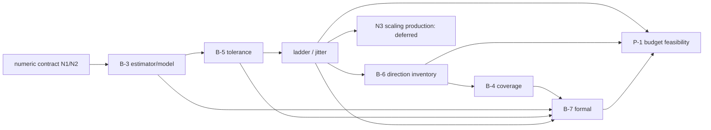

# #46 FD-08 v2 Stage 1.5 decision packet（提案・未承認）

本packetは、下記の推奨セット全体を**承認/却下の1回の判断**に掛けるためのもの。R6を開始した成果物ではない。数値セクションの停止条件(a)(b)(c)はfalseで、その監査後に設計した。historical Stage1 strict numeric conditionは**unmet17のまま**。[数値契約と検証](46_fd08_v2_numeric_contract_2026_10_06.md)を参照。

B-3〜B-7、jitter、予算、ladderはユーザー未承認。source/criteria/既存evidence/phase_plan変更0、R5FAIL固定。新規solver-free evidenceのみ。fd_oracle / field_gradient / reverse / optimizer / topology / shape_update_allowedは全てfalse。

## 1回で判断する推奨セット RCFG-1（未登録）

**この推奨セットを明示的に承認した場合にだけ、別作業でR6を登録する。今回の作業はここで停止する。** 承認は実測が良いという認定ではなく、以下の暫定・条件付き検証仕様と予算を採用する判断。登録前のhost/Float32/identity gatesが不合格なら止まり、方向やladderを勝手に代替しない。登録するcriteria/source/dataset hashesはその時点で別途固定する。

| ID | 決定事項 | Option A | Option B | Codex推奨 | 根拠 | 依存 |
| --- | --- | --- | --- | --- | --- | --- |
| N-1 | arithmetic | N1:mm fit、無次元形成後に表示換算 | N2:SI fit。N3はladder確定後のscaled案 | A=N1 | 同一単位で差を形成する原則。全候補判定一致。旧17を修正しない | 数値停止監査 |
| N-2 | 独立比較規則 | C5 conditional fit/operand bound +C4 semantic/認証margin。C1–3を診断保存 | pure relative C1のみ（近ゼロ不適合）/mixedC2のみ | A。未定義bound/曖昧marginはUNRESOLVED | 規則先freeze、46未使用seed+20historicalで超過0 | N-1、backend誤差仮定 |
| B-3 | estimator/model | 当該集合OLS pilot→one WLS、w=1/variance、A主/B対照、nominal C非χ²scale | 残差/sandwichや別noise estimatorは別契約 | A | fixed模型の再現性。公称covとモデルbiasの限界を明記 | N-1/2 |
| B-4 | coverage | COV-A:全登録方向×drag/downforce両方PASS | COV-B:事前一般3/4等。#23のscope変更が必要 | A、D1を含む4方向8系列全部 | every registered directionを維持。full-field全空間の保証はしない | B-6 inventory、B-5 |
| B-5 | scientific tolerance | T1:ユーザーδ指定後にerror budget | T2:8つのarbitrary-provisional paramsを明示承認 | B=T2、条件付きdiagnostic契約 | δを作らない。用途の精度保証は未成立 | B-3。T1ならδ指定まで停止 |
| B-6 | new direction | D0/D1/D2維持+P1 upstream lobeを将来1つ追加 | P2/P3の別ローブ、または新ローブなし | A=P1。登録前Float32/geometry/hash gates付き | 単一低次局在形の簡潔さ。force/cosineで選び直さない | L-1、normal/phi尺度、identity |
| B-7 | formal | 同じ4方向、未使用内部3magnitudesのpredict-then-run。別round baseline1 | 内部1magnitude（科学reviewの低費用案）、またはheld-out方向併用 | A=3点、formal25 states | 内挿を3箇所で点検。noise/外挿検証とは呼ばない | B-3/5、L-1、B-4、P-1 |
| J-1 | jitter | 2state/方向（1shiftedmagnitude） | 4state/方向（2magnitudes）、またはなし | **なし** | 少数Jはbias/fit/決定論的変動を分離せず、σ0を測れない。formal内挿に集中 | B-3/5、L-1、B-7 |
| P-1 | solver/kernel予算 | Budget A:両上限引上げ、20%以上planning margin | B:固定partition、C:能力維持のstates選択、D:jitter別round | A。calibration6600/11200 s、formal3300/5600 s | 49stateでも現solver5400に20%余裕なし。分割でaggregate capを隠さない | 全state inventory |
| L-1 | ladder | L6=geomspace(.5,5,6) mm | L8=.3–5/8点、L15=.5–15/7点 | A=L6（旧contractと別v2） | fullfit dof4、4internal holdouts、drop3後3点。R5FAILが選定理由ではない | B-3/5、J-1、Float32 |

T2 params: sigma0_n=3e−6 N、rho=.05、tol_se=.10、tol_nested=.15、tol_model=.15、tol_hold=.15、k_mag=5、nested_drop=2。出所・分類・仮定は[tolerance_options](../evidence/fd08_v2_stage1p5_2026_10_06/tolerance_options.md)。全て事前のarbitrary-provisionalで、measured/derived/synthetic-calibratedへ昇格しない。承認しても#23のδを定めたことにはならない。

B-6 P1の中心=active bbox割合(.25,.5,.5)、幅割合(.6,.8,.8)、a=max(1−r²,0)³、外向きu=a*n、δphi≈−a|∇phi|。taper/active mask後max normalization、Little-endian Float32/C順hashは**将来だけ**生成する。候補診断cosine対D0/D1/D2=−.869314487/−.0239745666/−.00260716546、force情報なし。登録前の案はabs duplicate cosine<.95、effectivecentered direction relativeL2≤.05、support外0/max1/finite、±changednode≥1、zero-margin/masks、cal/formal byte uniqueness。center/幅のforce後調整を認めない。これらhost gatesの失敗は登録を止める。[direction_design](../evidence/fd08_v2_stage1p5_2026_10_06/direction_design.md)は物理法線変位と名目SDF値変位の違い、RMS、supportを示す。

## state・予算の具体値

| inventory | states | solver estimate s | elapsed estimate s | solver +20% s | elapsed +20% s | 推奨cap solver/kernel s |
| --- | ---: | ---: | ---: | ---: | ---: | --- |
| R6 calibration:baseline1+4directions×6ε×2sign、jitterなし | **49** | 5326.30 | 8952.30 | **6391.56** | **10742.76** | 6600 /11200 |
| 将来formal:baseline1+4directions×3ε×2sign | **25** | 2717.50 | 4567.50 | **3261.00** | **5481.00** | 3300 /5600 |
| 別round合計（単一kernelにはしない） | **74** | 8043.80 | 13519.80 | 9652.56 | 16223.76 | 合計9900 /16800、各round独立cap |
| 2jitter/方向をcalibrationへ入れる代案 | 57 | 6195.90 | 10413.90 | 7435.08 | 12496.68 | 現5400/10800は**両方不足** |
| 4jitter/方向をcalibrationへ入れる代案 | 65 | 7065.50 | 11875.50 | 8478.60 | 14250.60 | 現上限不足 |

見積りは既存Stage1表の108.7solver+74overhead=182.7 s/stateを固定して再利用する。平均実績に20%を掛けたplanning reserveで、runtimeの確率保証ではない。起動/コンパイル/partition固定費の差は登録前のruntime設計に含める。Kaggleが必要な実行上限を提供するかは**今回未確認・未操作**で、提供不可なら登録停止しユーザー判断へ戻す。最新HEAD source位置は[budget_table](../evidence/fd08_v2_stage1p5_2026_10_06/budget_table.md)に記録。solver5400とkernel10800は別制約で、register_fd08_calibration.py:54を数値の場所とは扱わない。

## 依存DAGと停止点

数値契約は算術と比較の妥当性、B-3はモデル/重み/C、B-5は未使用点を含む閾値、ladder/jitterは点集合/費用/予測点、B-6はεの物理的意味とinventory、B-4は分母と全方向条件、B-7は予測と新byte列を固定する。budgetは完成inventoryの横断的制約であり、結果を見た閾値弱化を許す経路ではない。全設計を応答測定前に1契約としてhash固定する。

R6は最後のcalibrationというB計画の停止案を推奨セットに含める。scientific FAIL/UNRESOLVEDならformalへ進まず再協議、formal FAIL/UNRESOLVEDならcampaign成功にしない。インフラ失敗は科学的結果と区別するが、再試行規則/identityは事前登録し、任意の再探索を許さない。B-1:R5FAIL固定/新v2、B-2:局所方向微分を維持（secant化しない）の前提も維持する。

## レビューの一致・残すtradeoff

[独立数値レビュー](../evidence/fd08_v2_stage1p5_2026_10_06/independent_numerical_review.md)は事前仕様のみを読み、C5の欠落を指摘した。perturbedoperand/cross terms、inverse/weight/sqrt/row construction、serialization、margin、Decimal convergenceを**fixture実行前**に修正して固定した。C5は条件付きengineering envelopeで普遍保証ではない、という留保を採用した。

[独立科学レビュー](../evidence/fd08_v2_stage1p5_2026_10_06/independent_scientific_review.md)はユーザーspecのみを読み、公称covの限界、COV-A、T2条件付きdiagnostic/noδ発明、jitterなし、local6点とraised budgetを支持した。reviewerはformal1内部点/方向と滑らかなsurface-chart bumpを候補にした。親は既存設計の3内部点とcanonical grid上のC² polynomial lobeを推奨する。前者はsampling範囲対費用、後者はsurface projectionを増やす実装対既存grid契約の違いで、どちらもforce結果で選んでいない。ユーザーはB-7/B-6の代案を選べる。primary結論を見せて追認させたレビューではない。

## 実装前に残る科学的・実装上の曖昧さ

- T2 noise/covは仮定で、δに結合した用途上のaccuracy保証はない。gのmodel biasはA/B差や内部予測だけで上限保証できない。
- 5mm/25%曲率のsynthetic100%PASSはモデル誤指定を検出できなかった意味。A4の対象内誤通過0%をモデル十分性へ昇格しない。
- P1 scalar phi max=1はphysical normal max=εではない。解析一次近似はnormalmax/ε≈1.0017375、node RMS/ε≈.10900815。最終surface motion/Float32結果は未測定。
- 旧メモ4718とcurrentactive107415/D0–D2 support8339は異なる集合。特定εのchangednode数はまだない。旧証跡を修正せず、登録時に実現集合を監査する。
- geometry/Float32/byte uniqueness/source/Poisson tolerance/runtime bindingをfuture実装で検査しなければR6を登録できない。本packetは具体的なreject条件を選ぶが合格を予告しない。
- formalは決定論的solverの内挿検証。noise独立性、方向間一般化、外挿、grid独立性、真の物理/ε→0微分を認定しない。3σはjoint95%保証ではない。
- 全4方向PASSでも#23のfull-field全空間を証明しない。#23 qualificationにはそのbackend/比較契約も必要、LOWDIMは別scope。

## 成果物・確認

[numeric contract](46_fd08_v2_numeric_contract_2026_10_06.md)、[coverage](../evidence/fd08_v2_stage1p5_2026_10_06/coverage_options.md)、[tolerance/model](../evidence/fd08_v2_stage1p5_2026_10_06/tolerance_options.md)、[directions](../evidence/fd08_v2_stage1p5_2026_10_06/direction_design.md)、[formal](../evidence/fd08_v2_stage1p5_2026_10_06/formal_predict_then_run_design.md)、[jitter](../evidence/fd08_v2_stage1p5_2026_10_06/jitter_options.md)、[budget](../evidence/fd08_v2_stage1p5_2026_10_06/budget_table.md)、[ladders](../evidence/fd08_v2_stage1p5_2026_10_06/ladder_candidates.md)。登録済みsource変更候補は[implementation map](../evidence/fd08_v2_stage1p5_2026_10_06/implementation_change_map.md)。

focused39passed、compileall成功、full1530tests:37failed/1484passed/9skipped、保存済み37failure集合と新規0/解消0。[validation](../evidence/fd08_v2_stage1p5_2026_10_06/validation/validation_summary.json)にコマンド/結果/JUnit gzip/rawhashを保存。規則/source/全evidence hashes、既存変更0は最終監査で確認。**R6登録前で停止、solver未実行、6flags=false、phase_plan未変更**。
